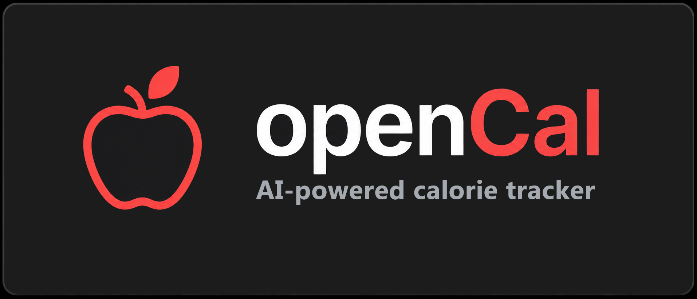

<div align="center">



<br>

**Un contador de calorías self-hosted que estima la nutrición de tu comida a partir de una foto.**

Foto de comida, análisis con IA, calorías y macros como rango — no como un número falsamente exacto.
Nada de cuentas obligatorias, email, planes de pago ni analítica de terceros. Solo `docker compose up`.

<br>

[](LICENSE)


</div>

<br>

## Por qué

La mayoría de apps de nutrición te obligan a crear una cuenta, envían tus fotos de comida a un servidor
que no controlas, y tarde o temprano piden una suscripción. openCal es lo contrario: **corre en tu
propio servidor, tus datos se quedan en tu base de datos, y el código es tuyo para modificar.** Sigue
siendo rápido de usar: haces una foto, la IA identifica los alimentos, tú ajustas las cantidades si hace
falta, y listo.

## Características

- **Cámara o galería** — haz una foto o elige una existente; se comprime en el navegador antes de enviarse.
- **Análisis con Gemini** — una única llamada por foto identifica alimentos, cantidades estimadas y confianza.
- **Rangos, no falsa precisión** — las calorías y macros se muestran como `≈ 550–700 kcal`, nunca como un
  número exacto que una fotografía no puede respaldar. El ancho del rango depende de la confianza de la
  detección y de si el alimento suele esconder calorías (aceites, salsas, guisos).
- **Edición local** — corrige los gramos de cualquier alimento, o añade uno que falte escribiendo su
  nombre; el recálculo es aritmética en el servidor, nunca una nueva llamada a la IA.
- **Comidas editables después de guardar** — vuelve a cualquier comida del historial y ajusta sus
  alimentos o cantidades cuando quieras.
- **Modo "solo para mí"** — instalación personal, sin usuarios ni contraseñas: entras directamente.
- **Modo "varios usuarios"** — cuentas por usuario y contraseña (nunca email), datos completamente
  aislados entre personas.
- **Light, Dark y Sistema** — tema cuidado en ambos modos, no una simple inversión de colores.
- **Mobile-first, PWA instalable** — pensada para usarse a diario desde el móvil, instalable como app.
- **Privado por diseño** — sin tracking, sin analítica de terceros, sin publicidad.

## Inicio rápido (self-host)

Necesitas [Docker](https://docs.docker.com/get-docker/) con Compose y una API key gratuita de
[Google AI Studio](https://aistudio.google.com/apikey) para Gemini.

```bash
git clone https://github.com/paaul19/opencal.git
cd opencal
cp .env.example .env
```

Edita `.env` y rellena al menos `GEMINI_API_KEY` y `AUTH_SECRET` (genera este último con
`openssl rand -base64 32`). Después:

```bash
docker compose up -d --build
```

Abre **http://localhost:3000**. La primera vez verás el asistente de configuración inicial.

## Configuración inicial

En el primer acceso a una instalación nueva, openCal pregunta cómo vas a usarla — **una sola vez**. No
hay login ni registro hasta que eliges un modo, y una vez elegido queda bloqueado: no existe una página
pública para volver a ejecutar el asistente.

```
Bienvenido a openCal
¿Cómo quieres utilizar esta instalación?

┌─────────────────────────────┐   ┌─────────────────────────────┐
│ Solo para mí                │   │ Para varios usuarios         │
│ Sin usuarios ni contraseñas │   │ Cada persona, su propia cuenta│
└─────────────────────────────┘   └─────────────────────────────┘
```

**Solo para mí** — pensado para uso doméstico: tú, tu servidor. No hay email, contraseña, login, logout
ni perfiles; entras directamente y usas tu espacio personal.

**Para varios usuarios** — crea la primera cuenta durante el propio asistente (usuario y contraseña,
nada más). A partir de ahí cada persona tiene sus datos completamente aislados, hay login/logout
normales, y se pueden crear cuentas adicionales desde `/register`.

openCal **nunca pide email** — ni para registrarte, ni para recuperar la contraseña, ni de ninguna otra
forma. Es intencional: al ser self-hosted, instalar la app no debería depender de configurar SMTP, un
proveedor de email transaccional u OAuth de terceros.

## Cómo funciona el análisis con Gemini

1. La foto se redimensiona y comprime en el navegador (máx. 1280px, JPEG) antes de enviarse.
2. El servidor valida el archivo (tipo, tamaño, cabecera real del formato) y hace **una única llamada** a
   Gemini pidiendo, con structured output (JSON Schema), qué alimentos hay, un **rango** de gramos
   estimado por alimento y la confianza de la detección.
3. openCal calcula las calorías y macros localmente a partir de una tabla de referencia nutricional
   (`prisma/seed.ts`), combinando el rango de gramos con la confianza y con si el alimento suele esconder
   calorías, para producir un rango de calorías realista en vez de `calorías ± 100` a ciegas.
4. Editar los gramos de un alimento, añadir uno manualmente o eliminarlo recalcula en el servidor **sin
   volver a llamar a Gemini** — la IA solo interpreta la foto una vez, incluso después de guardar.
5. Al guardar, la comida y sus alimentos, con sus rangos, se persisten en PostgreSQL.

**Qué se envía a Gemini:** únicamente la fotografía comprimida de la comida, en el momento de analizarla.
No se envían datos de usuario, ubicación ni ningún otro dato personal, y la imagen no se guarda en ningún
otro sitio — openCal no almacena fotografías (ver [Privacidad](#privacidad)).

## Configuración

Todo vía `.env` (ver [.env.example](.env.example)):

| Variable | Obligatoria | Descripción |
| --- | --- | --- |
| `DATABASE_URL` | Solo en dev local | Cadena de conexión de Prisma para `npm run dev`. Dentro de Docker se ignora — `docker-compose.yml` construye la suya apuntando al servicio `postgres`. |
| `GEMINI_API_KEY` | Para analizar fotos | Clave de Gemini. Sin ella, todo funciona salvo `POST /api/meals/analyze`. |
| `GEMINI_MODEL` | No | Modelo de Gemini a usar (por defecto `gemini-3.5-flash-lite`). Ajusta si Google renombra modelos. |
| `AUTH_SECRET` | Sí | Firma las cookies de sesión en modo multiusuario. Genera uno único por instalación. |
| `POSTGRES_USER` / `POSTGRES_PASSWORD` / `POSTGRES_DB` | Sí | Credenciales del contenedor de PostgreSQL. |

`GEMINI_API_KEY` y `AUTH_SECRET` se leen **solo en el servidor** — nunca llegan al navegador.

## Instalar como app (PWA)

En el móvil, abre openCal en el navegador y usa "Añadir a pantalla de inicio" (Safari) o "Instalar app"
(Chrome/Android). Se abre en modo standalone, sin barra de navegador, como una app nativa.

> Los iconos incluidos en `public/icons/` son un marcador de posición generado por script. Sustitúyelos
> por un diseño real (192×192 y 512×512) antes de publicar tu instalación.

## Tus datos

Viven en PostgreSQL, en el volumen Docker `postgres-data`. Sobreviven a `docker compose down` y a
reconstrucciones de la imagen; solo se pierden con `docker compose down -v`.

Backup manual:

```bash
docker compose exec postgres pg_dump -U opencal opencal > backup.sql
```

Restaurar:

```bash
cat backup.sql | docker compose exec -T postgres psql -U opencal opencal
```

## Actualizar

```bash
git pull
docker compose up -d --build
```

Al arrancar, el contenedor aplica automáticamente las migraciones de Prisma pendientes
(`prisma migrate deploy`, ver `docker-entrypoint.sh`) antes de iniciar la app. No hace falta ningún paso
manual.

## Desarrollo local

```bash
docker compose up -d postgres   # solo la base de datos
npm install
npx prisma migrate dev
npx tsx prisma/seed.ts
npm run dev
```

La app queda en `http://localhost:3000` con hot reload.

## Cómo funciona

Un único proyecto Next.js (App Router) hace de frontend y backend a la vez, sin microservicios, sin
colas y sin Redis.

```
┌──────────────┐         ┌──────────────────────────────────┐
│ Tu navegador │──HTTPS─▶│  openCal (Next.js)                │
│ / PWA        │         │   ├─ Frontend (React, Tailwind)   │
└──────────────┘         │   ├─ API (Route Handlers)         │
                          │   └─ Prisma ──────────────────┐  │
                          └────────────────────────────────┼──┘
                                                             ▼
                                                   ┌──────────────────┐
                                                   │  PostgreSQL      │
                                                   └──────────────────┘

openCal (servidor) ──HTTPS──▶ Gemini API   (solo al analizar una foto nueva)
```

### Single-user y multi-user: una sola arquitectura, no dos apps

El modo de instalación se guarda en una fila única de la tabla `Installation`. Un único punto,
[`src/lib/access.ts`](src/lib/access.ts), resuelve en cada petición quién es el propietario de los datos:

```
single-user:  request → la propia instalación → datos (ownerId = null)
multi-user:   request → usuario autenticado    → datos (ownerId = user.id)
```

`Meal.userId` es `null` en modo single-user (la comida pertenece a la instalación) y es el id del usuario
en modo multi-user. El resto del código — `MealService`, las rutas de API, las páginas — siempre trabaja
con ese `ownerId` sin necesitar saber en qué modo está la instalación: no hay dos rutas de código
separadas para los dos modos, solo una resolución de propietario distinta.

### Estructura del proyecto

```
src/
  app/
    page.tsx, history/page.tsx, meal/[id]/page.tsx   pantallas principales
    setup/page.tsx                                    asistente de configuración inicial
    login/, register/                                 solo relevantes en modo multiusuario
    settings/page.tsx                                 apariencia, cuenta, zona peligrosa
    api/
      setup/route.ts          configura el modo de instalación (una sola vez)
      auth/{login,register,logout,me}/route.ts
      account/route.ts        elimina cuenta (multi) o borra todos los datos (single)
      meals/
        analyze/route.ts      única llamada a Gemini
        recalculate/route.ts  recálculo puro, sin IA
        route.ts, [id]/route.ts
      foods/search/route.ts, summary/today/route.ts
  components/   CameraButton, FoodItem, NutritionSummary, AnalysisLoading, SetupWizard, SettingsView...
  services/
    ai/         FoodAnalysisService (interfaz) + GeminiFoodAnalysisService (implementación)
    nutrition/  NutritionService (rangos de calorías y macros)
    meals/      MealService
  lib/          prisma, auth, access (single/multi), installation, validation, rateLimit...
prisma/
  schema.prisma, seed.ts
```

`services/ai/GeminiFoodAnalysisService.ts` es la única pieza que conoce Gemini — el resto depende de la
interfaz `FoodAnalysisService`, así que cambiar de proveedor de IA en el futuro no toca rutas ni interfaz.

## Seguridad

- Contraseñas con hashing `bcrypt`, nunca en texto plano.
- Sesión firmada (JWT en cookie `httpOnly`, `secure` en producción).
- El propietario de cada petición se resuelve **siempre desde la sesión del servidor**, nunca desde un
  campo enviado por el cliente, evitando IDOR y mass assignment.
- `GET /api/meals/[id]` devuelve 404, no 403, si la comida no es tuya, para no filtrar si existe.
- El asistente de configuración (`/api/setup`) se niega a ejecutarse una segunda vez.
- El registro de nuevas cuentas (`/api/auth/register`) solo funciona si la instalación está en modo
  multiusuario.
- Rate limiting básico en memoria en login, registro, setup y análisis de fotos.
- Eliminar una cuenta usa cascada de base de datos (`onDelete: Cascade` en `User → Meal → FoodItem`): no
  quedan comidas ni alimentos huérfanos.

## Privacidad

- Sin tracking ni analítica de terceros.
- Las fotografías **no se almacenan**: se envían a Gemini para el análisis y no se guardan en disco ni en
  base de datos (el campo `Meal.imageUrl` existe por si en el futuro se añade esa opción, pero hoy
  siempre es `null`).
- El único dato que sale de tu servidor es la foto de comida, y solo hacia la API de Gemini, solo al
  analizar una foto nueva.
- En modo multiusuario, cada persona solo puede ver y modificar sus propios datos.

## Decisiones de diseño

- **Rangos en vez de números falsamente exactos** — el ancho depende de la confianza de Gemini, de si el
  alimento coincide con la tabla de referencia, y de si es un alimento que suele esconder calorías, no de
  un `± 100 kcal` fijo para todo. Ver `NutritionService`.
- **Sin almacenamiento de fotos**, para mantener el sistema simple y privado por defecto.
- **Nutrición sin API externa** — una tabla `FoodReference` con cerca de 100 alimentos comunes en vez de
  integrar USDA FoodData Central u Open Food Facts. `NutritionService` es el único punto que sabe de
  dónde vienen los valores, así que se puede sustituir sin tocar el resto de la app.
- **Sin middleware de Next.js para la autenticación** — Prisma no corre en el runtime Edge de Next 14, así
  que la comprobación de acceso vive en cada página y ruta (`requireOwnerId` / `resolveOwnerIdForApi`) en
  vez de en `middleware.ts`.
- **Rate limiting en memoria** — suficiente para una instalación de un usuario o familia en una sola
  instancia; es el primer punto a cambiar si esto llegase a correr con varias réplicas.

## Tech

Next.js 14 (App Router) · TypeScript estricto · Tailwind CSS · PostgreSQL + Prisma · Google Gemini ·
`bcryptjs` + `jose` para autenticación · iconos SVG propios, sin librería de iconos · sin Redis, sin
colas, sin microservicios.

## Contribuir

Issues y PRs bienvenidos. Antes de añadir una dependencia nueva, pregúntate si openCal realmente la
necesita: el objetivo es que el proyecto siga siendo pequeño, legible y fácil de auto-alojar.

## Licencia

[MIT](LICENSE) — libre y de código abierto. Puedes auto-alojar, usar, modificar y compartir openCal sin
restricciones.
